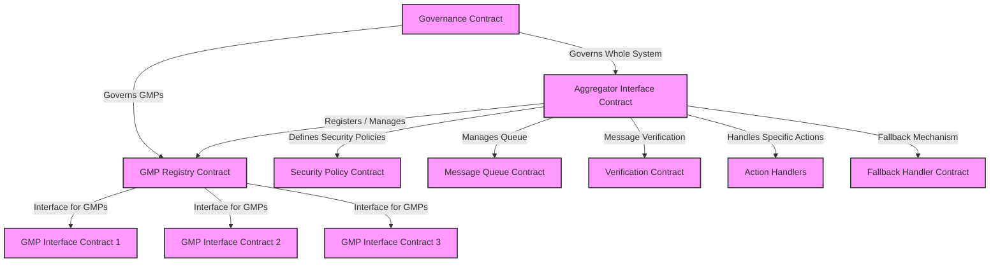

# Cross-Chain Generalized Aggregator (CCGA)

## Introduction
The Cross-Chain Generalized Aggregator (CCGA) is a smart contract platform designed to enable dApps to customize their cross-chain messaging and interactions. With a focus on flexibility and security, CCGA allows dApps to select from multiple General Messaging Partners (GMPs) such as LayerZero and CCIP, determining the appropriate level of security and redundancy for their specific needs.

## Components

### Aggregator Contract (AC)
The core smart contract that interfaces with multiple GMPs. It serves as the primary point of interaction for dApps, routing messages and managing cross-chain communication.

### GMP Interface Contracts
Individual smart contracts for each GMP, adhering to a unified interface for message sending. These are called by the AC to facilitate message delivery.

### Security Level Selector
A built-in function of the AC allowing dApps to specify their desired level of security for each action, enabling a choice in the number of GMPs required.

### Message Queue
A managed queue within the AC that holds and processes messages to be sent, working in tandem with the GMP Interface Contracts.

### Verification and Execution Module
Post-delivery, this module is responsible for the verification of message integrity and authenticity, crucial when multiple GMP confirmations are necessary.

### Action Specific Handlers
Dedicated functions within the AC that cater to specific actions (e.g., bridge transfers, liquidations) and manage the logic for utilizing single or multiple GMPs.

### Fallback Mechanism
A contingency protocol within the AC that reroutes messages via an alternate GMP in cases where the primary service fails or is unresponsive.

### Governance Module
A democratic system allowing the dApp community to participate in the governance of the CCGA, including voting on GMPs and security protocols.

## Conclusion
The CCGA provides a customizable and secure framework for dApps to engage in cross-chain activities, from routine transfers to complex operations. It is built with the vision of empowering dApps with the autonomy to define their cross-chain interaction schemes while maintaining high standards of security and reliability.

